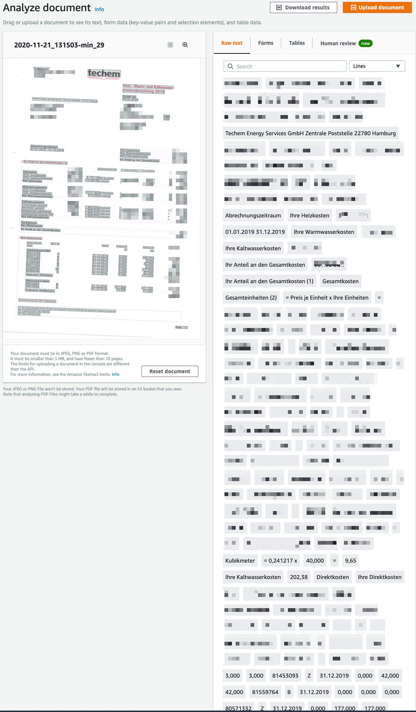
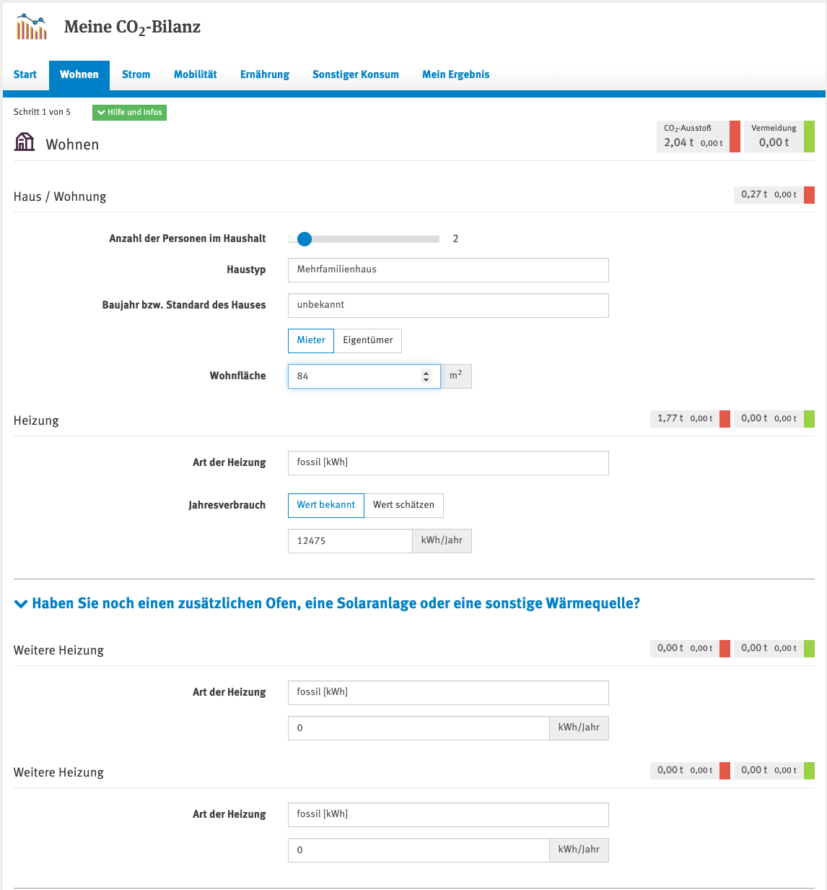
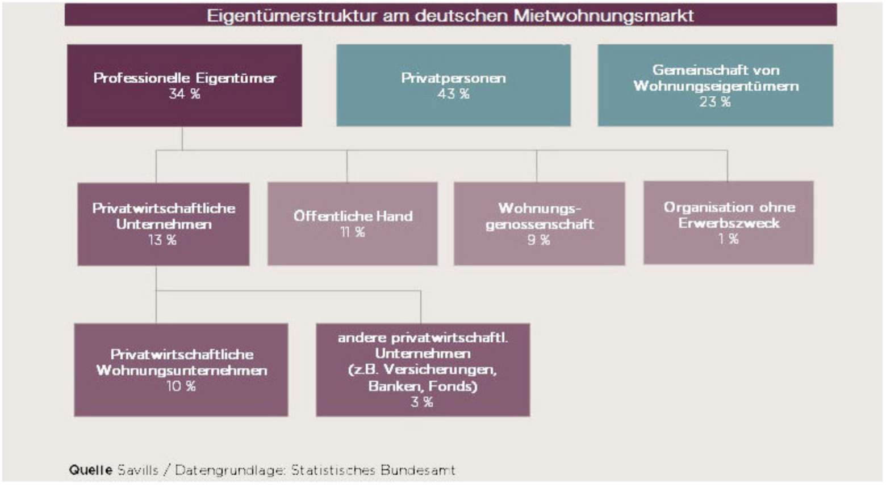

# Vemidi - CO2 einsparen für Mieter:innen und Vermieter:innen

## Kurzbeschreibung

Vemidi hilft CO2-Emissionen in vermieten Immobilien einzusparen und die [Emissionen im Gebäudesektor bis 2030 um über 50%](https://www.umweltbundesamt.de/presse/pressemitteilungen/treibhausgasemissionen-sinken-2020-um-87-prozent) zu reduzieren.

Vemidi erfasst Wohnungs- und Abrechnungsdaten und begleitet die daraus entstandenen Handlungsempfehlungen für Mieter:innen und Vermieter:innen.

[Zusammenfassung - Folien Ende April](https://github.com/tilmann/vemidi/blob/main/docs/assets/21_04_30_Vemidi_summary.pdf)

### Problem

1. Richtiges Heizverhalten ist schwierig zu bewerten und die Selbsteinschätzung von Mieter:innen ist oftmals falsch.

2. Energetische Sanierungen von Mietwohnungen sind für Mieter:innen und Vermieter:innen ein Konfliktthema, da die Investitionen und "gewonnenen" Einsparungen auf Kosten und CO2 Seite nicht transparent sind.

   - Mieter:innen haben Angst, dass durch eine energetische Sanierunge ein finanzieller Nachteil entsteht: die Kosten werden auf ihre Miete umgelegt, die Nebenkosten sinken nur um einen Teil der Mietsteigerung (Sanierung ist nicht warmmietenneutral).

   - 75% der private Vermieter:innen sind [nicht einmal grob über den energetischen Zustand ihres Gebäudes](https://initiative-energieeffiziente-gebaeude.de/de/zum-thema) informiert. Eine Sanierung birgt Konfliktpotential mit den Mieter:innen.

3. Engpass für die passenden Maßnahmen im Bestand sind evtl. die Handwerker:innen / Heizungsbauer:innen / etc., die

   - In Sachen Energieeffizienz und neue, energiesparende Technologien nicht geschult sind _oder_

   - zu viel zu tun haben _oder_

   - Eigeninteressen haben und eventuell eine Präferenz für herkömmliche, nicht aber für besonders energiesparende Technologien

### Annahmen

- Heizkostenabrechnungen enthalten Hinweise, wie das Heizverhalten im Haus und der eigenen Wohnung zu bewerten ist.
- Mieter:innen möchten energetische Sanierungen, wenn sich die Gesamtkosten (Kaltmiete plus Energiekosten) für die Wohnung langfristig nicht übermäßig erhöhen.
- Bei Mieter:innen wächst das Bewusstsein für den CO2 Footprint und der Bedarf diesen zu senken steigt.
- Vermieter:innen sind bereit zu sanieren, wenn es die Rendite nicht übermäßig schmälert und CO2 Einsparungen bringt.
- Das Thema wird weiter gefördert
- In absehbarer Zeit wird Vermieter:innen einen Teil der CO2-Kosten tragen müssen.

### Lösung

Eine Webanwendung, die es Mieter:innen ermöglicht die Daten zur Wohnung einzutragen und Bilder ihrer Strom- und Heizabrechnungen hochzuladen und daraus Handlungsoptionen, Berichte und Modelle für Mieter:innen und Vermieter:innen aufbereitet. Die Berichte und Modelle zeigen auf, warum eine energetische Sanierung für beide Seiten langfristig Sinn ergibt, welcher Sanierungsweg sich anbietet und und wie diese "fair" abgebildet werden kann.

Diese Informationen sollen Mieter:innen und Vermieter:innen anstoßen mit Energieberater:innen ins Gespräch zu gehen und Projekte zu starten.

Die aufbereiteten Daten sollen verwendet werden können, um eine Beantragung von Fördermitteln zu vereinfachen.

Langfristig können Energieberater:innen und Handwerker:innen eingebunden werden um eine passende Umsetzung einfacher zu beauftragen.

Im [Papier von Agora](https://static.agora-energiewende.de/fileadmin/Projekte/2020/2020_07_Warmmieten/A-EW_190_Mieterschutz_Klimaschutz_WEB.pdf) wird argumentiert, dass _Warmmieten mit Temperaturfeedback_ das Vermieter-Mieter-Dilemma auflösen können. Wir glauben, dass umfangreiche Aufklärungsarbeit geleistet werden muss, die aufzeigt, dass dies eine faire Lösung ist, die die Interessen von Mieter:innen und Vermieter:innen miteinander vereinbart und dabei hilft, die Klimaziele im Gebäudesektor zu erreichen.

## Gesellschaftlicher Impact

Im Jahr 2020 hat aus allen Sektoren [nur der Gebäudesektor die Klimaziele für Deutschland gerissen](https://www.umweltbundesamt.de/presse/pressemitteilungen/treibhausgasemissionen-sinken-2020-um-87-prozent). Es besteht ein dringender Bedarf Altbestand zu sanieren, um die Klimaziele für Deutschland im Bereich Gebäude zu erreichen.

Stand heute sind die Interessenlagen von Mieter:innen und Vermieter:innen nicht gleichgerichtet. Der Mietmarkt in Deutschland basiert im Allgemeinen auf Kaltmieten. Dies bedeutet, dass Mieter:innen die anfallenden Heizkosten tragen, was zum Vermieter-Mieter-Dilemma führt:

Während Vermieter:innen für die Kosten einer energetischen Sanierung aufkommen, profitieren zunächst nur Mieter:innen durch reduzierte Heizkosten. Vermieter:innen legen die Kosten daher auf die Mieter:innen in Form der Kaltmiete um, was zu Intransparenz führt.

Mieter:innen können ihre Heizkosten nur durch eine Verbrauchsreduktion beeinflussen, denn auf die Heizungsart und den Wärmebedarf der Wohnung haben sie keinen direkten Einfluss.

Vemidi kann helfen die CO2 Emissionen durch Gebäude zu senken und bringt Mieter:innen und Vermieter:innen zusammen und hilft ihnen durch ein besseres Verständnis gemeinsam Geld und CO2 zu sparen.

## Technische Umsetzung

Ziel ist es eine Webanwendung bereit zu stellen.

Diese basiert auf eine Sammlung von Docker Containern, die als Microservices miteinander agieren und die auf einer beliebigen IaaS Plattform gehostet werden können.

Folgende Services sehen wir im **Backend** als nötig:

- Datenbank - MongoDB
- API inkl Benutzerverwaltung - NodeJS / TypeScript basierend auf FeathersJS
- Erkennung (OCR) von Dokumenten - Nutzung von OpenSource Bilderkennung oder Adapter zu Machine Learning Services von Amazon Web Services (AWS), Microsoft Azure oder Google Cloud. Hier wurde bereits getestet wie gut die Erkennung von Heizkostenabrechnungen funktioniert und es wurde gezeigt, dass die Daten problemlos erkannt werden:
  
- E-Mailservice - noch zu definieren
- PDF Erstellung - node-wkhtmltopdf - ein Service, der Webseiten in PDFs exportiert

Das **Frontend** wird mit React und Tailwindcss umgesetzt und D3.js wird verwendet um Daten visuell aufzubereiten.

Der Code wird auf Github gehostet und es werden die dort bereitstehenden Werkzeuge für die Organisation des Projektes verwendet. (Project Boards, Issues)

Für das Hosting und die Build Pipeline des Projektes passen die Programme AWS Activate mit 1000 Euro AWS Guthaben oder Microsofts AI for Earth Grants mit 5000 Euro Azure Guthaben.

## Andere Marktteilnehmer und Angebote

### CO2-Bilanz Rechner

Die Bestimmung des CO2 Bilanz der eigenen Wohnsituation ist auf mehreren Webseiten möglich:

Ein Beipiel ist der Rechner des Umweltbundesamt: [https://uba.co2-rechner.de/de_DE/living-hs](https://uba.co2-rechner.de/de_DE/living-hs)

Es wird eine einfache Erfassung basierend auf den Quadratmetern und dem Heizbedarf verwendet. Diese Rechner sind Teil einer CO2-Gesamtbilanz. Dies Erfassung adressiert einen anderen Bedarf als Vemidi.

### co2online.de

In Deutschland ist das bekannteste Werkzeug zur Aufklärung in diesem Bereich das Portal co2online.de. Hier können Interessierte mit Hilfe von Onlinerechnern in allen Bereichen rund um das Wohnen ihre Energieeinsparpotenziale berechnen. Das Angebot ist sehr groß und damit teilweise etwas unübersichtlich.

Im Test hat sich gezeigt, dass die manuelle Erfassung der Daten zur Wohnung aus den Abrechnungen fehlerbehaftet ist.

Bislang wird von co2online.de das Problem der Kommunikation zwischen Mieter:innen und Vermieter:innen nicht adressiert. Es gibt keine Berichte und Modelle, die zusammenfassen warum eine Sanierung für beide Seiten Sinn ergeben kann. Eine langfristige Anlage einer Wohnung und das Abbilden der Maßnahmen ist nicht möglich.

Wir glauben, dass Vemidi hier Mieter:innen und Vermieter:innen durch ein einfacheres und zielgerichteteres Angebot einen klaren Mehrwert bieten kann und sich ausreichend von co2online.de abgrenzt.

## Zielgruppe und GoToMarket

Die Customer Journey von von Vemidi startet bei Mieter:innen. Wir glauben, dass Mieter:innen drei Motivationen haben energieeffizienter zu Wohnen:

Grund 1: Niedrigere Heizkosten

Grund 2: Bessere Wohnqualität

Grund 3: Bewusstsein für CO2 Bilanz wächst

Mieter:innen sollen befähigt werden professionell, fair und datengestützt mit dem Vermieter ins Gespräch zu gehen um eine energetische Sanierung fair zu gestalten.

Weiterhin ist es geplant eine Partnerschaft mit Mietervereinen und anderen Verbraucherorganisationen aufzubauen. Mietervereine suchen nach Möglichkeiten, um die nötigen energetischen Sanierungen passend aufzubereiten und haben einen vertrauensvollen Zugang zu Mietern.

Weiterhin soll Pressearbeit erfolgen um in überregionalen Publikationen aufzutauchen. Wir glauben, dass Vemidi ein Angebot ist, dass für viele Mieter:innen interessante Einsparpotenziale für Kosten und CO2 bietet.

## Die optimale Wohnung

Aus Gesprächen mit Experten haben wir gelernt, dass der Markt sich stark aufteilt. Während die professionellen Eigentümer bereits eigene Teams aufgebaut haben, die sich mit dem Prozess der energetischen Sanierung beschäftigen, werden die Privatpersonen, die Wohnungen besitzen heute nicht angesprochen.

Laut den Ergebnissen des Zensus werden deutschlandweit rund 52 Prozent aller Wohnungen zur Miete angeboten. Die Mietwohnungen befinden sich zu etwa zwei Dritteln im Eigentum von Privatpersonen. Ein weiteres Fünftel des Mietwohnungsbestandes gehört der Öffentlichen Hand und Genossenschaften.

 [Quelle](https://www.immobilienmanager.de/das-sind-die-groessten-wohnungseigentuemer-in-deutschland/150/67019/)

## Warum jetzt

Bislang waren die größte Blocker nach Aussage von Energieberater:

- Förderung erst seit 2019
- Programm: Heiztaustausch plus
- Das Programm wurde so gut angenommen, dass bereits dreimal Geld nachgeschoßen wurde

## Offene Herausforderungen

- Es gibt zuwenig Fachfirmen - die Anzahl müsste sich verdoppeln
- Heizverhalten verändern ist nicht einfach
  - Mehrheit heizt falsch
  - Verhalten ist "gelernt"
- Nutzer und Gebäude
  - Jedes Ableseunternehmen macht das anders
  - Energieberater brauchen Zeit um die Daten zu finden
